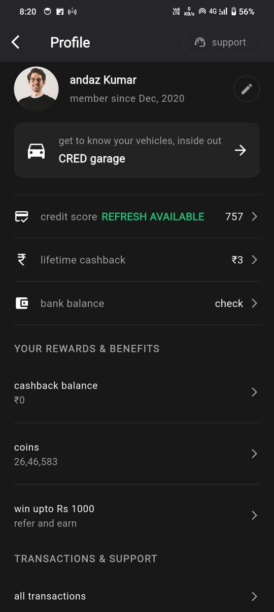
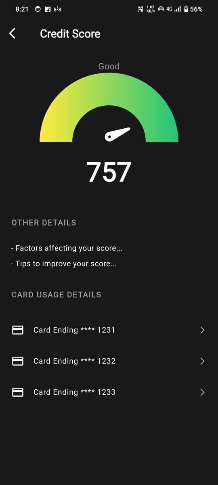
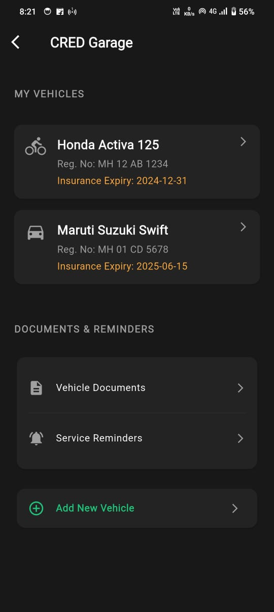
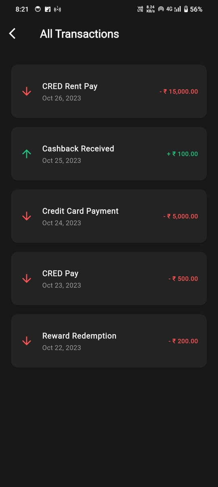

# 📱 App UI Implementation – Internship Assignment (Andaz Kumar)

A sleek **Flutter** application developed as part of an internship assignment. The task was to replicate the given **Profile Activity UI** with precision, modular structure, and modern design principles.

---

## 🔍 Overview

This app represents a financial management interface with a **dark theme**, **smooth animations**, and a **component-based layout**. The UI is crafted to reflect a user-centric experience, similar to real-world fintech applications.

---

## ✨ Features

- **Profile Screen**: User info, vehicle cards, bank balance, cashback, credit score, and rewards.
- **Credit Score**: Speedometer chart with category-based scoring and suggestions.
- **Bank Balance**: Animated balance, multiple accounts, formatted transactions.
- **Vehicle Management**: Add/view vehicles, insurance & service tracking, docs.
- **Transactions & Referral**: Categorized transactions and referral program UI.

---

## 📸 Screenshots

| Profile Screen | Credit Score | Bank Balance |
|----------------|--------------|--------------|
|  |  |  |

| Vehicles | Transactions |
|----------|--------------|
|  |  |

---

## 📲 APK Download

👉 [**Download Latest APK**](apk/app-release.apk)

---

## 👨‍💻 Author

Made with ❤️ by **Shreyash-devs**  
A passionate developer who enjoys turning ideas into reality using Flutter, Firebase, and a touch of creativity.

- 🔗 [LinkedIn](https://www.linkedin.com/in/shreyashdubewar)  
- 📱 [GitHub](https://github.com/shreyash-devs)  
- ✉️ shreyashdevs.work@gmail.com
